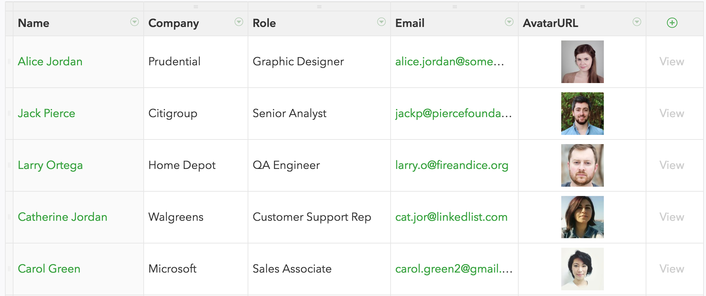

# AC3.2 MidtermReview: Local/Remote Contacts
---

### [FieldBook API](https://fieldbook.com)

Real, json-formatted database that you can create/read/update/delete elements. 

We will be using their "Contacts" template to create a simple table of info that will be query-able as well. 

### Project Artboard

### Individual Artboards

1. Main 
  - [Main - Local Tab](./Images/Artboards/Main - Local Tab.png)
  - [Main - Cloud Tab](./Images/Artboards/Main - Cloud Tab.png)
2. Add
  - [Add Local](./Images/Artboards/Add Local.png)
  - [Add Local Sample](./Images/Artboards/Add Local Sample.png)
  - [Add Local Success](./Images/Artboards/Add Local Success.png)
  - [Add Local Fail](./Images/Artboards/Add Local Fail.png)
  - [Add Cloud](./Images/Artboards/Add Cloud.png)
  - [Add Cloud Success](./Images/Artboards/Add Cloud Success.png)
  - [Add Cloud Fail](./Images/Artboards/Add Cloud Fail.png)
3. Edit
  - [Edit Cloud](./Images/Artboards/Edit Cloud.png)
  - [Edit Cloud Warning](./Images/Artboards/Edit Cloud Warning.png)
  - [Edit Cloud Success](./Images/Artboards/Edit Cloud Warning Copy.png)
4. Delete
  - [Delete Cloud](./Images/Artboards/Delete Cloud.png)
  - [Delete Cloud Warning](./Images/Artboards/Delete Cloud Warning.png)
  - [Delete Cloud Success](./Images/Artboards/Delete Cloud Warning Success.png)
